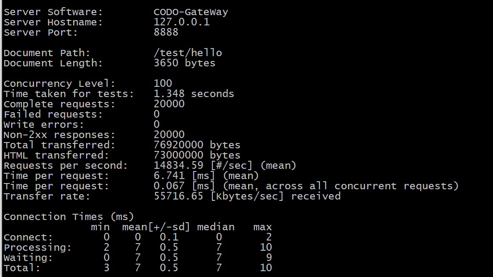
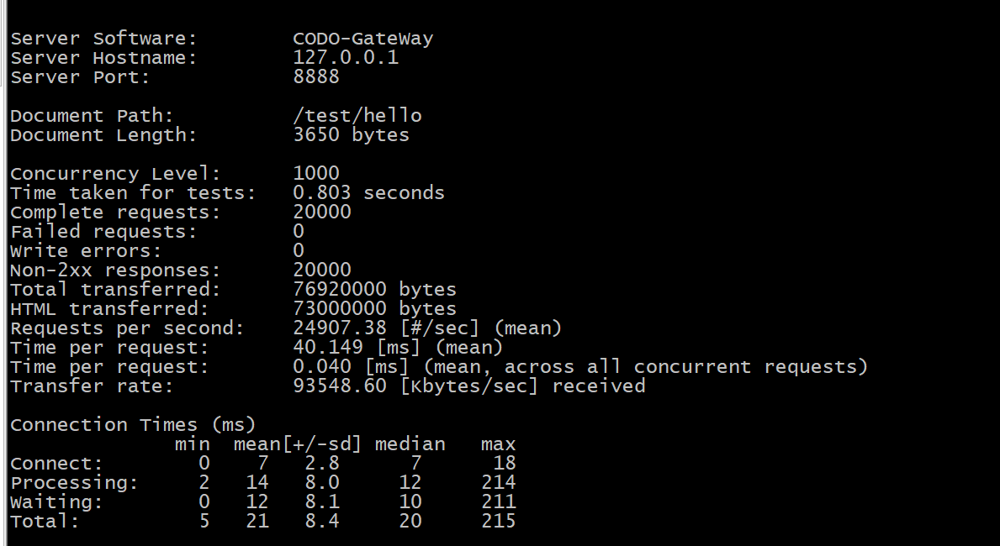
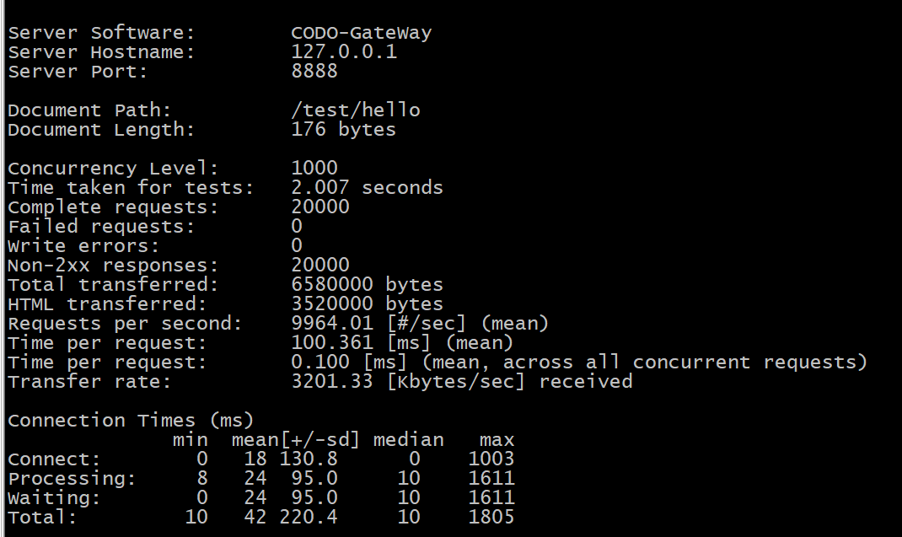
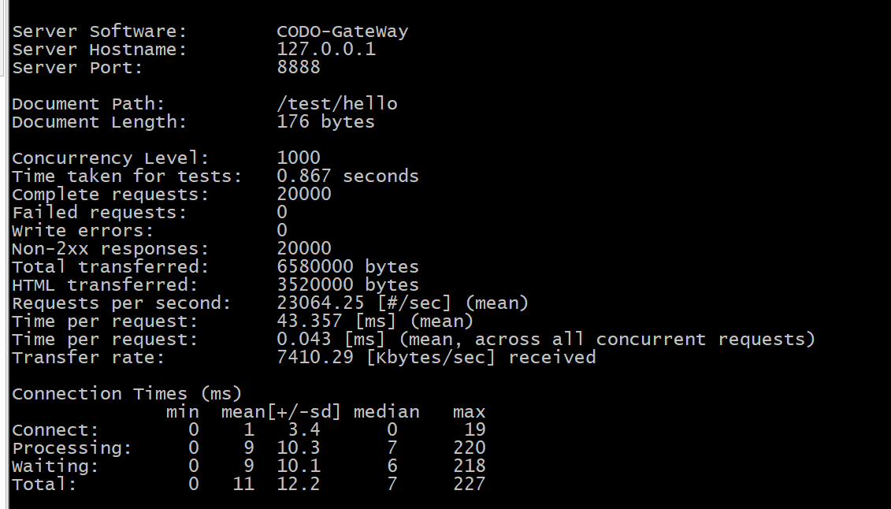

# 天门

借鉴 apisix 实现的轻量级网关服务


## 简介。

项目中参考和引用了[ws-cloud-gateway](https://github.com/tech-microworld/ws-cloud-gateway)和[apisix](https://github.com/apache/apisix)的源码。
对codo所使用的api网关进行优化

## 目录

- [特性](#特性)
- [文档](#文档)
- [立刻开始](#立刻开始)
- [性能测试](#性能测试)
- [社区](#社区)
- [视频和文章](#视频和文章)
- [全景图](#全景图)
- [贡献](#贡献)
- [致谢](#致谢)
- [协议](#协议)
- 

## 特性

你可以当做流量入口，来处理所有的业务数据，包括动态路由、动态上游、动态证书、
A/B 测试、金丝雀发布(灰度发布)、蓝绿部署、限流限速、抵御恶意攻击、监控报警、服务可观测性、服务治理等。


<font size="3" color="#dd0000">插件文档待完善</font> 

- **全平台**

  - 云原生: 平台无关，没有供应商锁定，无论裸机还是 Kubernetes，APISIX 都可以运行。
  - 运行环境: OpenResty
  - 
- **多协议**
  - [gRPC 代理](doc/zh-cn/grpc-proxy.md)：通过 APISIX 代理 gRPC 连接，并使用 APISIX 的大部分特性管理你的 gRPC 服务。
  - [gRPC 协议转换](doc/zh-cn/plugins/grpc-transcode.md)：支持协议的转换，这样客户端可以通过 HTTP/JSON 来访问你的 gRPC API。
  - Websocket 代理
  - Proxy Protocol
  - HTTP(S) 反向代理
  - [SSL](doc/zh-cn/https.md)：动态加载 SSL 证书
  - 
- **全动态能力**
- **精细化路由**
- **安全防护**
- **运维友好**
- **高度可扩展**

## 性能测试

## 文档
[文档索引](doc/README.md)

## 更新日志
[更新日志](doc/README.md)

## 立刻开始
### 编译和安装

准备在以下操作系统中可顺利安装并做过测试：

CentOS 7, Ubuntu 16.04, Ubuntu 18.04, Debian 9, Debian 10, macOS

有以下几种方式来安装Release 版本:

1. 源码编译（适用所有系统）
   - 安装运行时依赖：OpenResty 和 etcd，以及编译的依赖：luarocks。参考[依赖安装文档](https://github.com/apache/apisix/blob/master/doc/zh-cn/install-dependencies.md)
   
   - 下载最新的源码发布包：
   
     ```shell
     git clone  xxx.git
     ```
   
     

   - 编译部署
   
     ```shell
      $ cd  api-gateway 
      # 安装运行时依赖的 Lua 库：
      $ make deps
      $ \cp -arp .
     /usr/local/openresty/nginx/
     ```
   
     
   
   - 启动 :
     ```shell
     $ /bin/systemctl start openresty.service
     ```
2. Docker 镜像（适用所有系统）

   默认会拉取最新的发布包：

   ```shell
   $ docker build . -t gateway_image
   $ docker-compose  up -d
   ```
   
### 针对开发者 
> 开发者去看apisix的文档，写的比较完整

#### 检查
```
#安装
$ luarocks install luacheck 
$ luacheck -q gateway
```

## 性能测试

### wrk 测试

```bash
# 安装wrk
$ git clone https://github.com/wg/wrk.git 
$ cd wrk && make
$ cp wrk /bin/
$ sh benchmark/run-wrk.sh 

```

### AB 测试

AB测试 1核心 RPS 14000  4核心24000 ，token和rbac验证RPS分别为 10000  24000










## 整体架构


## 服务发现
服务启动时，将自己的节点信息注册到etcd，包括：服务名称、ip、端口

网关服务从 etcd 监听服务节点信息，保存到缓存中，从客户端请求的url中提取服务名称，通过服务名称查找节点信息，将请求转发到后端服务


## 插件功能列表

- [x] 服务发现，动态路由
- [x] 自动生成 requestId，方便链路跟踪
- [x] 控制面板 
- [x] gRPC 代理  
- [x] jwt  用户登录认证
- [x] rbac   用户登录认证鉴权
- [ ] 动态ip防火墙
- [ ] 限流器
- [ ] 接口协议加解密
- [ ] 统一配置管理
- [ ] 外部日志记录 

## 控制面板
http://localhost:8888/dashboard


## 鸣谢

- [ws-cloud-gateway](https://github.com/tech-microworld/ws-cloud-gateway)
- [apisix](https://github.com/apache/apisix)

## 协议

[GPL v3.0](https://www.gnu.org/licenses/gpl-3.0.html).
